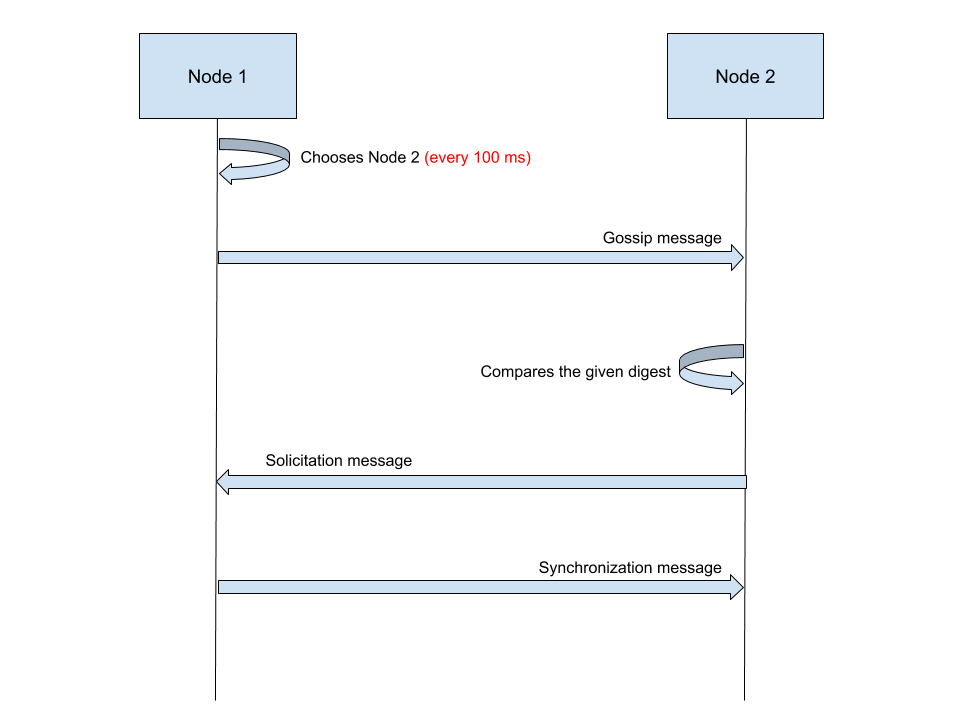
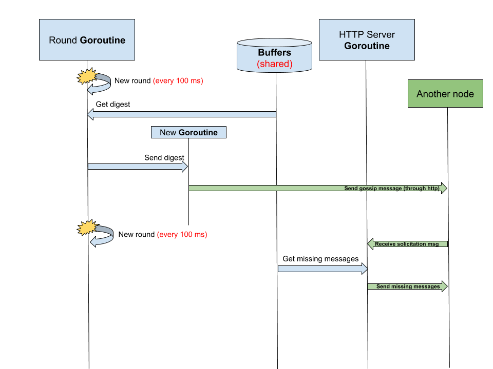
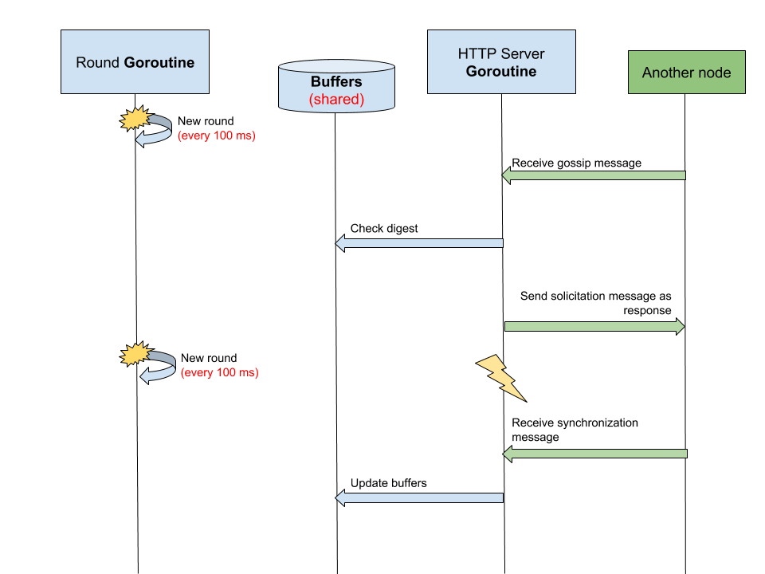

# Bimodal Multicast Protocol

At the beginning of each round, every node `randomly` chooses another node and
sends it a `digest` of its `message histories`. The messsage is the `gossip 
message`.

The node that receive the `gossip message` compares the given `digest` with the
messages in its own `message buffer`.

If the `digest` differs from its `message histories`, then it send a message
back to the original sender to request the missing messages. The message is 
called `solicitation`.

### Sequence diagram

### Round goroutine vs. HTTP Server goroutine

### Receiving a gossip message

