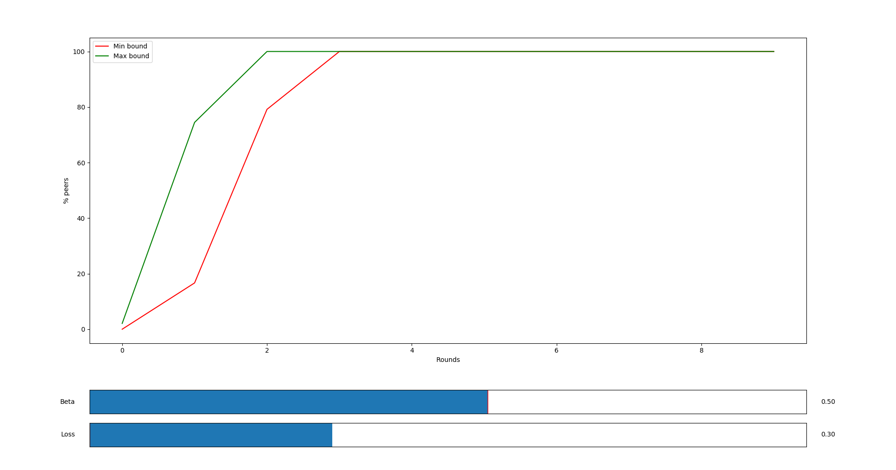

# Bimodal Multicast Protocol

[](https://semaphoreci.com/rstefan1-11/bimodal-multicast)

This is an implementation of the Bimodal Multicast Protocol written in GO.

Currently can only sync string messages. This will be improved in the following
versions.

## Overview

The Bimodal Multicast Protocol runs in a series of rounds.
At the beginning of each round, every node randomly chooses another node and
sends it a digest of its message histories. The message is called gossip
message.
The node that receive the gossip message compares the given digest with the
messages in its own message buffer.
If the digest differs from its message histories, then it send a message
back to the original sender to request the missing messages. This message is
called solicitation.

## Usage

* Imports

```golang
import (
    "github.com/rstefan1/bimodal-multicast/pkg/bmmc"
)
```

* Configure the protocol

```golang
    host := "localhost"
    port := "14999"

    cfg := bmmc.Config{
        Addr:   host,
        Port:   port,
        Peers: []bmmc.Peer{
            {
                Addr: host,
                Port: port,
            },
        },
        Callbacks: map[string]func (string) (bool, error) {
            "awesome-callback":
            func (msg string) (bool, error) {
                fmt.Println("The message is:", msg)
                return true, nil
            },
        },
    }
```

#### Note! The buffer will be updated only if the callback function call returns true.

* Create an instance for protocol

```golang
    p, err := bmmc.New(cfg)
```

* Start the protocol

```golang
    p.Start()
```

* Stop the protocol

```golang
    p.Stop()
```

* Add a new string message in buffer

```golang
    p.AddMessage("awesome message", "awesome-callback")
```

* Get all messages from the buffer

```golang
    messages := p.GetMessages()
```

* Add a new peer in peers buffer

```golang
    p.AddPeer("localhost", "18999")
```

* Remove a peer from peers buffer

```golang
    p.RemovePeer("localhost", "18999")
```


## Performance

When beta is 0.5 and loss is 30% (after 20 retries):




## Roadmap to v0.2.x
 - [x] create an instance of Bimodal Multicast Protocol, start it,
 stop it, add message and retrieve all messages
 - [x] metrics
 - [x] register callbacks for each messages
 - [ ] add and remove peers via protocol
 - [ ] circular message buffer
 - [ ] more details about protocol in readme
 
## Contributing

We welcome all contributions in the form of new issues for feature requests, bugs
or even pull requests.

## License

This project is licensed under Apache 2.0 license. Read the [LICENSE](LICENSE) file
in the top distribution directory for the full license text.
